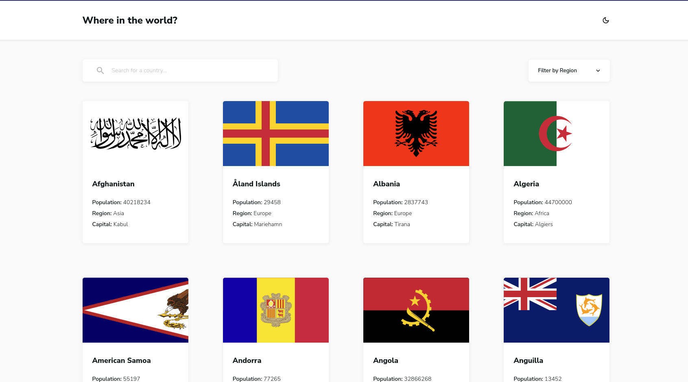
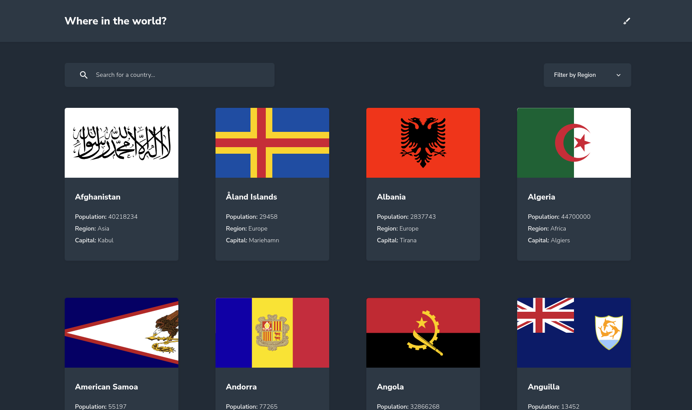

# Frontend Mentor - REST Countries API with color theme switcher solution

This is a solution to the [REST Countries API with color theme switcher challenge on Frontend Mentor](https://www.frontendmentor.io/challenges/rest-countries-api-with-color-theme-switcher-5cacc469fec04111f7b848ca). Frontend Mentor challenges help you improve your coding skills by building realistic projects. 

## Table of contents

- [Overview](#overview)
  - [The challenge](#the-challenge)
  - [Screenshot](#screenshot)
  - [Links](#links)
- [My process](#my-process)
  - [Built with](#built-with)
  - [What I learned](#what-i-learned)
  - [Continued development](#continued-development)
  - [Useful resources](#useful-resources)
- [Author](#author)
- [Acknowledgments](#acknowledgments)

## Overview

### The challenge

Users should be able to:

- See all countries from the API on the homepage
- Search for a country using an `input` field
- Filter countries by region
- Click on a country to see more detailed information on a separate page
- Click through to the border countries on the detail page
- Toggle the color scheme between light and dark mode *(optional)*

My achievements beyond the challenge proposed features:

- Support all available regions, including missing Antarctic region
- Implement 'All' region filter option
- Implement different routes for searching, filtering and navigating details page.
- Support screen sizes between the two proposed 375px and 1440px breakpoints
- Encapsulate reusable logic for accessing API country objects
- Implement a fake REST API identical to the real API for development enviroment
- Split UI into smaller and reusable components
- Sort countries alphabetically
- Implement a Vuex Store
- Rewrite the project for using Pinia instead of Vuex
- Add typescript
- Implement style-resources-loader for loading scss global styles
- Persist current theme to local storage
- Implement a third experimental theme
- Implement page transition animations
- Implement card hover effect
- Implement scroll to top component
- Support refresh to default home functionality when clicking the page title
- Implement no results message component
- Implement border countries button hover effect
- Implement commitlint with gitmoji config
- Try to follow a commit message pattern

### Screenshots

### Links

- Solution URL: [My Solution](https://www.frontendmentor.io/solutions/vue-pinia-scss-responsive-mirage-fake-api-axios-scroll-top-bem-920DEiMcRy)
- Live Site URL: [rest-countries-api-chi-five.vercel.app](rest-countries-api-chi-five.vercel.app)

## My process

### Built with

- Semantic HTML5 markup
- SCSS(https://sass-lang.com) - CSS Extension 
- Flexbox
- CSS Grid
- Mobile-first workflow
- [Vue 3](https://vuejs.org) - Vue framework
- [Pinia](https://pinia.vuejs.org) - Pinia store library for Vue
- [TypeScript](https://www.typescriptlang.org) - TypeScript

### Continued development

I may add unit tests in the future for learning purposes.

## Author

- Frontend Mentor - [Canichim](https://www.frontendmentor.io/profile/sacboulardii)
